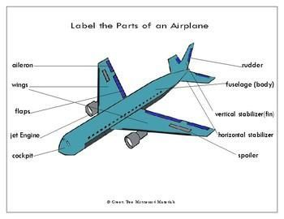

# Annotation Instructions

  1. [Introduction](#introduction)
  2. [Terminology](#terminology)
      1. [Label](#label)
      2. [Attribute](#attribute)
  3. [Jobs](#jobs)
      1. [Container](#container)
          1. [Size and Type](#size-and-type)
      2. [Owner code](#owner-code)
          1. [*challenging*](#challenging)
          2. [*legible*](#legible)
          3. [*value*](#value)
      3. [Size and Type](#size-and-type-1)
          1. [*challenging*](#challenging-1)
          2. [*legible*](#legible-1)
          3. [*value*](#value-1)
      4. [Serial number and Check digit](#serial-number-and-check-digit)
          1. [*challenging*](#challenging-2)
          2. [*legible*](#legible-2)
          3. [*value*](#value-2)
      5. [Frame Issue](#frame-issue)
      6. [Adverse Condition](#adverse-condition)
          1. [*Dirty lens*](#dirty-lens)
          2. [*Fog*](#fog)
          3. [*Heavy Rain*](#heavy-rain)
          4. [*Heavy Snow*](#heavy-snow)
  4. [Exceptions](#exceptions)

 Introduction
---

 
The task is structured to generate **annotated dataset** by succesfully converting _raw image_ data into training dataset for **Rekise's** machine vision model inorder to implement shipping containers detection along with the specification [Labels](#label) associated with the container.
There are multiple [Jobs](#jobs) to be annotated and each further branches into multiple attributes. 

Terminology
---
  ### Label
  Definition: Labels are used to describe the characteristics or qualities of people, activities, or things. Example:-
  
  
  
  
  [Labels](#jobs) in our task:
  - Labels are used to assign defined category to different components in the image data set. 
  - It correctly identifies the shipment [Containers](#container) along with the associated parameters.

  

    

  ### Attribute
  Definition: Attributes are used to describe a quality or characteristic that someone or something has:
  
  
  
  Attributes in our task:
  - Attributes are common quality or characteristics of a labeled category.
  - It consists of properties that define different aspects of the labeled category.
  - It could be the associated  [value](#value),  [Size and Type](#size-and-type), [legiblity](#legible) etc.

  

Jobs
---
  ### Container

  Definition: Container describes an object which is used for holding or transporting different materials and objects.
  
  - In this Job one is required to label the container elements defined by their fitting corners in the image dataset.
  
  
  - Start with creating bounding boxes around the container .
  - Label entirely around the object with maximum proximity.
    
    

|                   |        Important points   |
| ------------------ | :----------------: | 
| |1.Label only those images where corner fits are clearly visible    | 
|✔| |  |     
|❌|               |
| |2.There should not be a significant gap between the Bounding Box edge and the container edge |
|✔||  
|❌|        |
||3.The Box Shape is required to be a rectangle    |
|✔| |   
|❌|               |
|  | 4.Do not overlap the bounding box with the container edges. 
|✔|                 | 
|❌|               |
|  | 5.Container codes with blurring should not be labelled but can be included as a container attribute  
|✔|                 | 
|❌|               |

#### Size and Type

  - Input the value associated with size and type label to identify the shipment container.
 
    

 ### Owner code

 Definition: Number or characters are used to identify the container, Container owner code recognizes the container owner with the BIC.

The container owner’s code consist of four capital letters, the first three character are the owner prefix and the last character identifies the equipment category.

Code                          |  description
----------------------------------|------------------------------------------------------------------------------------
The owner prefix (BIC code)  |  Three capital letters of the Latin alphabet to indicate the owner or principal operator of the container
The equipment category identifier: |  U for all freight containers,J for detachable freight container-related equipment, Z for trailers and chassis.

(Example )

#### *challenging*
  Mark true if you find it hard to interpret the bounding box associated with the label.
#### *legible*
  Mark true if the label is readable and the correct values can be extracted. 
#### *value*
  Input the value representing the label.

### Size and Type

Definition: It is the container marking codes to depict the length, height and type of container in an easy to read sequence. This sequence is composed of four letters or digits that commonly appear right under the container identification sequence.

Code                         |  description 
----------------------------------|------------------------------------------------------------------------------------
Size  |  The container size is indicated by two alphanumeric characters defining length and height
Type |  The container type and main characteristics is indicated by two characters

(Example )

#### *challenging*
  Mark true if you find it hard to interpret the bounding box associated with the label.
#### *legible*
  Mark true if the label is readable and the correct values can be extracted. 
#### *value*
  Input the value representing the label.

### Serial number and Check digit

Definition:

**Serial number** consists of 6 numeric digits, assigned by the owner or operator, uniquely identifying the container within that owner/operator’s fleet.

**Check digit** consists of one numeric digit providing a means of validating the recording and transmission accuracies of the owner code and serial number.

 

Code                         |  description 
----------------------------------|------------------------------------------------------------------------------------
The serial number  |  six Arabic numerals, left at owner‘s or operator‘s option.
The check digit |  one Arabic numeral providing a means of validating the recording and transmission accuracies of the owner code and serial number.

(Example )

#### *challenging*
  Mark true if you find it hard to interpret the bounding box associated with the label.
#### *legible*
  Mark true if the label is readable and the correct values can be extracted. 
#### *value*
  Input the value representing the label.

   

### Frame Issue

### Adverse Condition
- Mark the label if any of the following attributes are present in the Image: 
  
  #### *Dirty lens*
  #### *Fog*
  #### *Heavy Rain*
  #### *Heavy Snow*

## Exceptions

- For occluded objects - label them entirely.
- label objects that are partially out of frame.
- Input partially distorted or erased value as * in the value attribute field.
  - Example:
  
  

- Example :
  *The following label for size and type would be considered challenging as the contrast between background and character is too low.*

 

- The following case with no container in foreground need not be labelled.
  
 

- Do not mark the distorted and blurred images for OCR labels :
  
  

